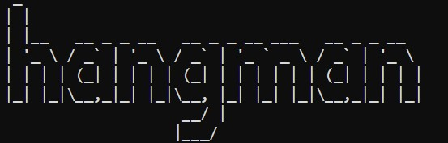
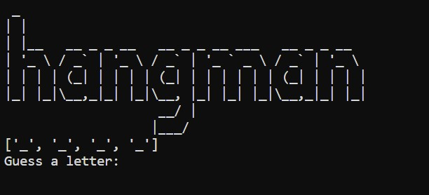
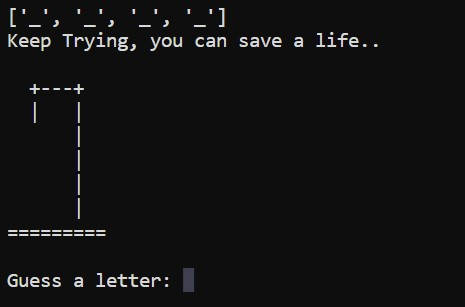
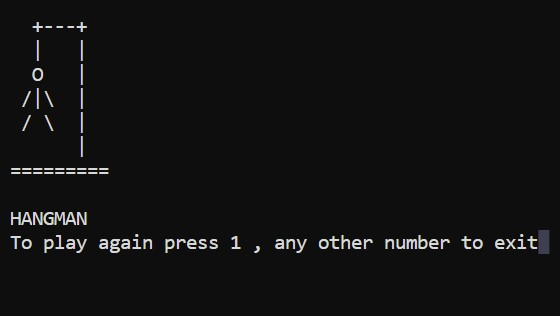

## Hangman

### A fun Guessing Game

### How to install ?

You can just clone the repository and run the program on your computer

### How to play ?

1. Game will randomly select a word
2. You will be displayed the no. of letter in word by blank spaces.
3. You will have to guess the letters of the word, if you guess all the letters you win.
4. You will have 6 lives or 6 unsuccessfull attempts, as life decreases the hangman gets
   closer to getting hanged, after 6 unsuccessful attempts hangman is hanged and game over.
5. At last you will be asked to if you want to replay the game, press 1 if yes or any other
   number if no.

### Screen Shots

